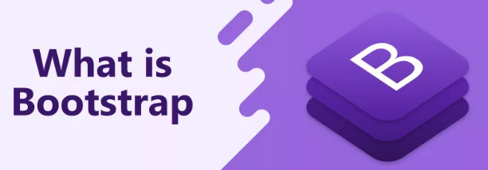
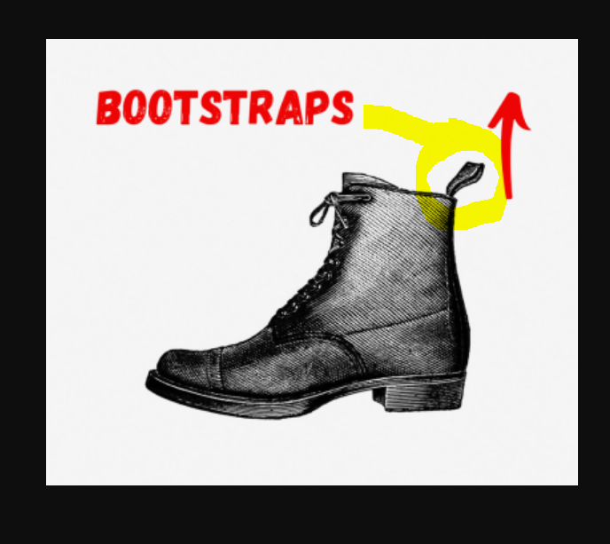
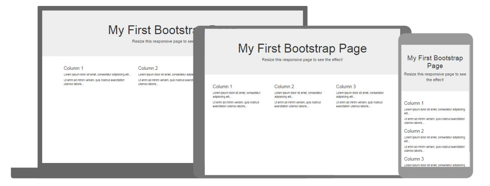

# Les 2: Mobile First

## Inleiding

Als moderne web developer in de dag vandaag is "Mobile First" ontwikkelen een must.

Een website op je desktop bekijken alsof het op een smartphone bekeken word;
druk op F12 en dan op de knop die lijkt op een "smartphone". Zie afbeelding hieronder:

## Tools

Enkele tools die hierbij kunnen helpen;

- Flexbox
- Bootstrap
- CSS Grid

## Flexbox

Hebben we ook gezien in Website Productie 1.

Op CSS-Tricks staat [Flexbox](https://css-tricks.com/snippets/css/a-guide-to-flexbox/#flexbox-background) nog beter uitgelegd.

## Bootstrap

We zien enkele oefeningen om dit praktisch te bekomen.

### Wat is bootstrap

Bootstrap (letterlijk laarzenlus, een hulpmiddel om een rijlaars met behulp van een speciale haak, aan te trekken) is een verzameling hulpmiddelen voor het maken van websites en webtoepassingen.

#### Waarom?

Het is gratis en open source. Het bevat sjablonen gebaseerd op HTML en CSS voor typografie, formulieren, knoppen, navigatie en andere interfaceonderdelen. Het bevat ook JavaScript-extensies. Het Bootstrap-framework is bedoeld om webontwikkeling te vereenvoudigen.

[Documentatie van Bootstrap](https://getbootstrap.com/docs/5.0/getting-started/introduction/)

Heel handig is ook dat het ons kan helpen met "Mobile First" te ontwikkelen. Zonder veel moeite kunnen we onze website ontwikkelen die dan goed leesbaar is op zowel mobiel als op desktop.

[(waarom niet Bootstrap gebruiken)](https://www.incentro.com/nl-nl/blog/stories/5-redenen-waarom-ik-geen-bootstrap-meer-gebruik/)

### Bootstrap Documentatie

#### Grid System

[Grid system uitleg](https://getbootstrap.com/docs/5.0/layout/grid/)

#### Breakpoints

[Breakpoints uitleg](https://getbootstrap.com/docs/5.0/layout/breakpoints/)

Breakpoint        | Class infix | Dimensions
----------------- | ----------- | ----------
X-Small           | _None_      | <576px    
Small             | `sm`        | ≥576px    
Medium            | `md`        | ≥768px    
Large             | `lg`        | ≥992px    
Extra large       | `xl`        | ≥1200px   
Extra extra large | `xxl`       | ≥1400px   

### Bootstrap Zelf toepassen

[Enkele voorbeelden van Bootstrap op W3schools](https://www.w3schools.com/bootstrap/bootstrap_templates.asp)

Hier nog meer voorbeelden voor Bootstrap Templates:

[https://bootstrapmade.com/](https://bootstrapmade.com/) hier kan je templates vinden