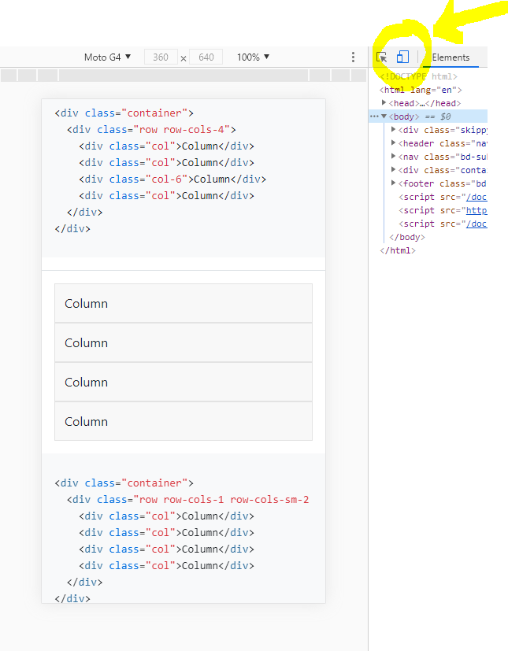

# Les 2: Mobile First

## Inleiding

Als moderne web developer in de dag vandaag is "Mobile First" ontwikkelen een must.

Een website op je desktop bekijken alsof het op een smartphone bekeken word;
druk op F12 en dan op de knop die lijkt op een "smartphone". Zie afbeelding hieronder:

## Tools

Enkele tools die hierbij kunnen helpen;

- Flexbox
- CSS Grid
- Bootstrap

## Praktisch

We zien enkele oefeningen om dit praktisch te bekomen.
